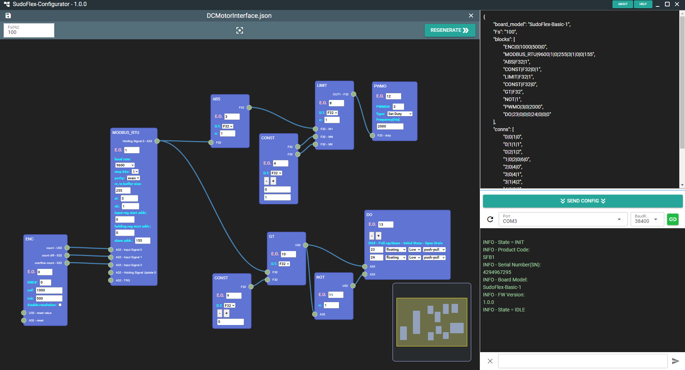

# SudoFlex-Basic-1 (SFB1) Digital Control Board:
SudoFlex project aims to create a board family for digital control applications. SFB1 board is the first step of the project and the only available board in the market for now. This repository includes all necessary information and resources to start to use SFB1. Front and back views of the board are shown below.

|Front|Back|
|:-:|:-:|
|  |  |

## SudoFlex-Configurator:
SudoFlex-Configurator is a desktop GUI application used for developing control algorithms. It has also a serial interface that can be used for downloading generated algorithms to the board and tracing log messages. A screenshot of the aaplication can be seen on the figure below.



SudoFlex-Configurator only works on 64-bit Windows and Linux platforms for now. Dedicated installers -exe for Windows and AppImage for Linux- for the latest release(1.0.0) can be found under the Releases section.

### Notes for Installation:
* SudoFlex-Configurator is a self-signed application. Therefore, Windows may try to block installation by Smart Screen. You can continue installation by clicking "**More info**" text.
* SudoFlex-Configurator needs a serial port connection to communicate with the board. Therefore, you need to add the user to the "**dialout**" group under Linux. Following command can be used for this purpose:
  ```bash
  sudo usermod -a -G dialout <username>
  ```
  Also, access permisions of the port may need to be changed under Linux. For example, following command can be used to change the access permisions of ttyUSB0:
  ```bash
  sudo chmod a+rw /dev/ttyUSB0
  ```

