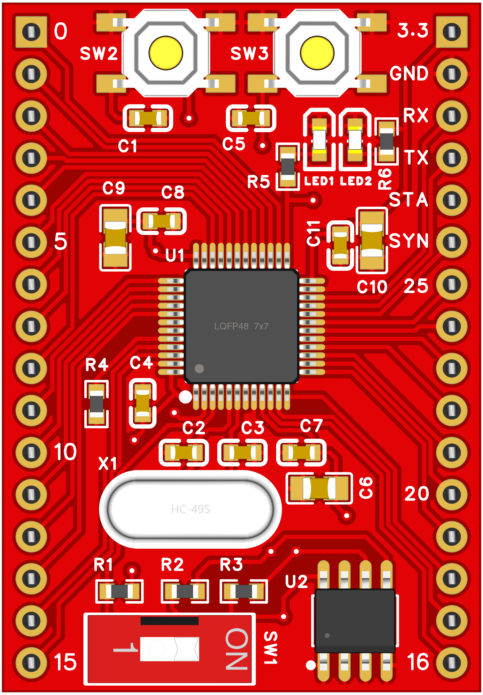
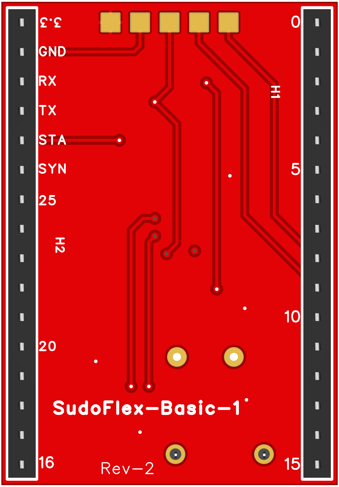

# SudoFlex-Basic-1 (SFB1) Digital Control Board
SudoFlex project aims to create a board family for digital control applications. SFB1 board is the first step of the project and the only available board in the market for now. This repository includes all necessary information and resources to start to use SFB1. Front and back views of the board are shown below.

|Front|Back|
|:-:|:-:|
|  |  |

## ewr
