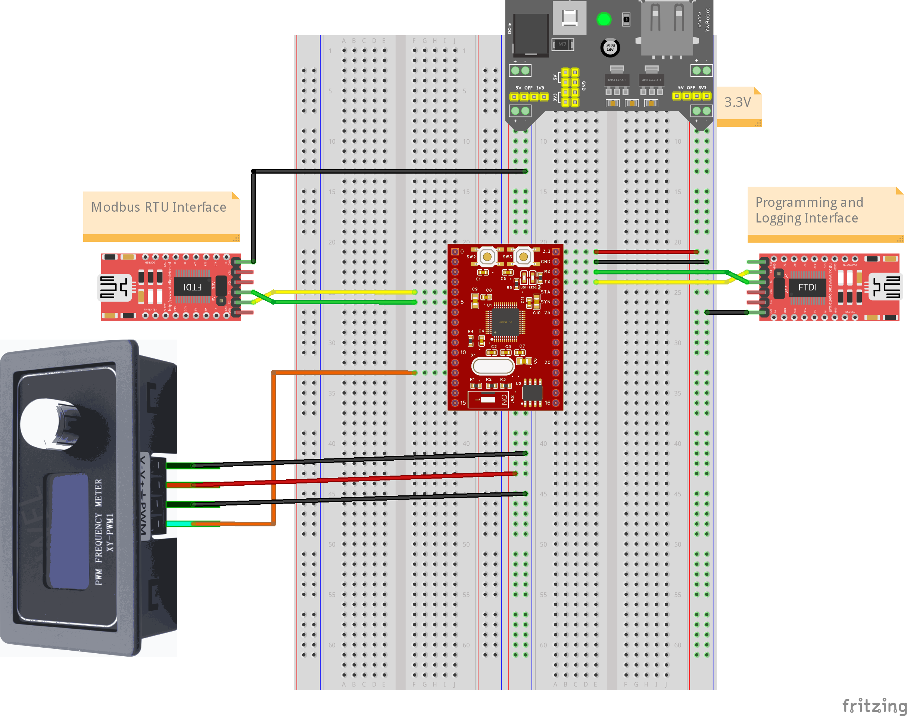
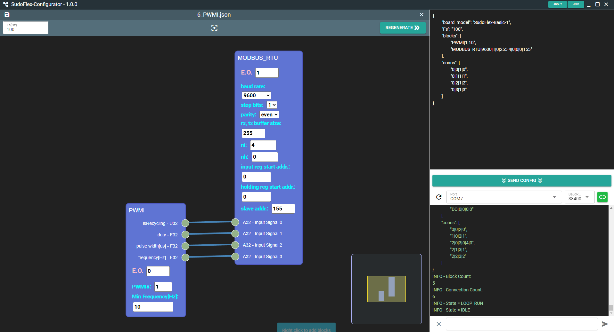

# SudoFlex-Basic-1 (SFB1) Digital Control Board

# Table of Contents:
- [Introduction](#introduction)
- [Pin mapping and button/led definitions](#pin-mapping-and-buttonled-definitions)
- [Minimum connections](#minimum-connections)
- [SudoFlex-Configurator](#sudoflex-configurator)
  - [Notes for Windows users](#notes-for-windows-users)
  - [Notes for Linux users](#notes-for-linux-users)
- [Examples](#examples)
  - [1-Led blink](#1-led-blink)
  - [2-Button/led interface with DI and DO](#2-buttonled-interface-with-di-and-do)
  - [3-MODBUS_RTU](#3-modbus_rtu)
  - [4-Analog input with AI](#4-analog-input-with-ai)
  - [5-Incremental Encoder Input with ENC](#5-incremental-encoder-input-with-enc)
  - [6-Measuring duty-cycle, pulse-width, and frequency of a signal by PWMI](#6-measuring-duty-cycle-pulse-width-and-frequency-of-a-signal-by-pwmi)
  - [7-Generating PWM signal with PWMO](#7-generating-pwm-signal-with-pwmo)

# Introduction
SudoFlex project aims to create a board family for digital control applications. SFB1 board is the first step of the project and the only available board in the market for now. This repository includes all necessary information and resources to start to use SFB1. Front and back views of the board are shown below.

|Front|Back|
|:-:|:-:|
|  |  |

Control algorithms for the board are developed by built-in blocks and block connections. There are 94 blocks for different functions. A summary of the blocks can be found below.

* 4 Type Conversion Blocks: **F32_U32, U32_F32, F32_S32, S32_F32**
* 4 Float Check Blocks: **ISNAN, ISINF, ISFINITE, ISNORMAL**
* 4 Rounding Blocks: **CEIL, FLOOR, TRUNC, ROUND**
* 15 Numerical Blocks: **SQRT, CBRT, LN, LOG, LOG2, EXP, EXP2, SIN, COS, TAN, ASIN, ACOS, ATAN, ATAN2, ABS**
* 14 Arithmetic Blocks: **ADD, MUL, ADDC, MULC, SUB, DIV, MOD, FMOD,
REMAINDER, EXPT, HYPOT**
  * **SMA**: Simple Moving Average
  * **CMA**: Cumulative Moving Average
  * **EMA**: Exponential Moving Average
* 8 Bitwise Operation Blocks: **SHL, SHR, ROL, ROR, BITAND, BITOR, BITXOR,
BITNOT**
* 5 Selection Blocks: **MAX, MIN, LIMIT, SEL, MUX**
* 6 Comparison Blocks: **GT, GE, LT, LE, EQ, NE**
* 6 Logic Blocks: **NOT, AND, OR, XOR, ANDBFOR, ORBFAND**
* 2 Flip-flop Blocks:
  * **SR**: Set dominant flip-flop
  * **RS**: Reset dominant flip-flop
* 2 Edge Detection Blocks:
  * **R_TRIG**: Rising edge detection
  * **F_TRIG**: Falling edge detection
* 3 Counter Blocks:
  * **CTU**: Up counter
  * **CTD**: Down Counter
  * **CTUD**: Up-down counter
* 3 Timer Blocks:
  * **TON**: On-delay timer
  * **TOF**: Off-delay timer
  * **TP**: Pulse timer
* 6 I/O Blocks:
  * **DI**: Digital input
  * **DO**: Digital output
  * **PWMO**: PWM output
  * **PWMI**: PWM input
  * **ENC**: Incremental encoder input
  * **AI**: Analog input
* 5 Source Blocks:
  * **CONST**: Constant numbers
  * **CAPTURE**: Captures input values when triggered
  * **TIME**: Provides time value in terms of sampling period
  * **WAVE**: Generates custom defined wave
  * **PULSE**: Pulse generator. Useful for step motor driving.
* 5 Control Blocks:
  * **UDELAY**: Unit delay, delays input for one sampling period
  * **TFD_1**: First-order discrete transfer function
  * **TFD_2**: Second order discrete transfer function
  * **TFD_3**: Third-order discrete transfer function
  * **PID**: PID controller with anti-windup and derivative filter
* 1 Connectivity Block:
  * **MODBUS_RTU**: Modbus RTU communication
* Other Blocks: **PAUSE**

For a detailed reference information about SFB1 you can refer to the user manual in pdf format. Latest user manual can be found under [Releases](https://github.com/sudorobotics/SudoFlex/releases) section.

# Pin Mapping and Button/Led Definitions
Pin mapping and button/led definitions can be seen on the table below.


| Abbreviation | Description |
| :---        |    :----   |
| DIx | Digital Input pins |
| DOx | Digital Output pins |
| PWMIx | PWM Input pins |
| PWMOx | PWM Output pins |
| ENCx | Incremental Encoder Input pins | 
| AIx | Analog Input pins |
| AOx | Analog Output pins |
| MODBUS_xx | Modbus RTU pins |
| SYNC (26) | Synchronization pin. This pin goes high at the start of       sampling and stays high during algorithm execution. So signal frequency is equal to sampling frequency and signal pulse width shows the algorithm execution time. |
| STA (27) | If algorithm execution time exceeds sampling period this pin goes high. It is also connected to STA led. |
| TX, RX (28, 29) | UART Programming Interface pins for SudoFlex-Basic |
| GND (30) | Ground pin for SudoFlex-Basic |
| 3.3V (31) | Power pin for SudoFlex-Basic. Applied voltage must not exceed 3.3V and should be regulated. |
| RFS | Return to factory settings button. If this button is pressed during reset, board clears the saved algorithm and returns to default algorithm string. |
| RST | Reset button |
| LoopSW | Loop on-off switch |
| PWR | Power led |
| STA | Status led. This led turns on if sampling frequency is too high for the current algorithm execution or sampling frequency is zero. |

# Minimum Connections
In order to start developing with SudoFlex board, one has to make minimum connections as shown on the figure below. First, regulated 3.3V power must be supplied to the board. Second, a UART-USB converter board should be connected to the SudoFlex board to make a programming and logging interface connection with SudoFlex-Configurator running on the computer. UART-USB converter boards are common in the market and can be obtained easily at reasonable prices. Both FTDI and CH340 based boards are perfectly convenient, however CH340 based boards may need driver installation.


# SudoFlex-Configurator
SudoFlex-Configurator is a desktop GUI application used for developing control algorithms. It has also a serial interface that can be used for downloading generated algorithms to the board and tracing log messages. A screenshot of the application can be seen on the figure below.


SudoFlex-Configurator only works on 64-bit Windows and Linux platforms for now. Under [Releases](https://github.com/sudorobotics/SudoFlex/releases) section, there are 3 application files:
* SudoFlex-Configurator.Setup.1.x.x.exe: Setup file for Windows installation.
* SudoFlex-Configurator.1.x.x.exe: Portable Windows application file for users that want to use the application without installation.
* SudoFlex-Configurator-1.x.x.AppImage: Linux application file

## Notes for Windows users
* You can use setup file for installing SudoFlex-Configurator as a regular Windows desktop application. SudoFlex-Configurator is a self-signed application. Therefore, Windows may try to block installation by Smart Screen. You can continue installation by clicking "**More info**" text.
* If you don't want to install SudoFlex-Configurator, you can use the portable application file. You can directly run the application by running this file. Unfortunately again, Smart Screen may block you running the application.

## Notes for Linux users
* .AppImage file is the self-contained application file for Linux. You can directly download this file, make it executable, and run the application in Linux.
* SudoFlex-Configurator needs a serial port connection to communicate with the board. Therefore, you need to add the user to the "**dialout**" group under Linux. Following command can be used for this purpose:
  ```bash
  sudo usermod -a -G dialout <username>
  ```
  Also, access permisions of the port may need to be changed under Linux. For example, following command can be used to change the access permisions of ttyUSB0:
  ```bash
  sudo chmod a+rw /dev/ttyUSB0
  ```
# Examples

## 1-Led blink
 
 

## 2-Button/led interface with DI and DO
 


## 3-MODBUS_RTU


## 4-Analog input with AI


## 5-Incremental encoder input with ENC


## 6-Measuring duty-cycle, pulse-width, and frequency of a signal by PWMI



## 7-Generating PWM signal with PWMO

